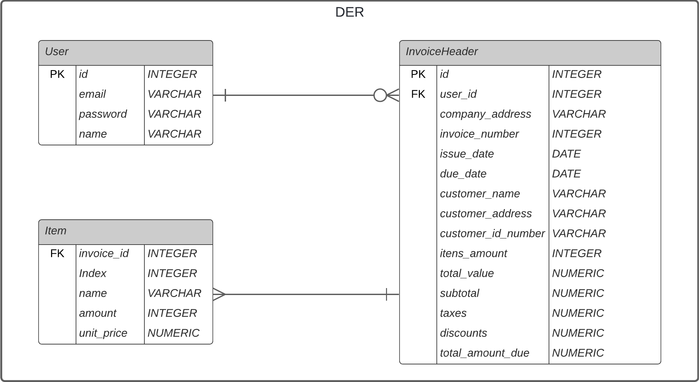
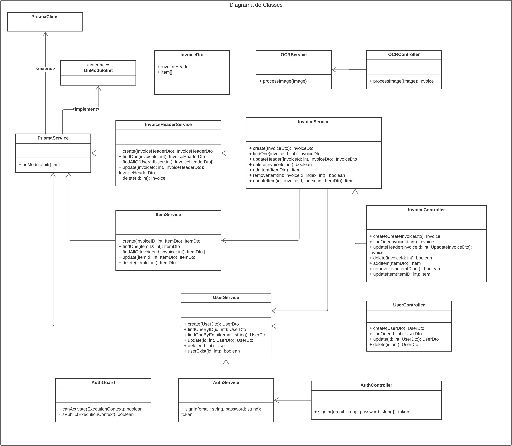

# Introdução

O objetivo deste projeto é criar uma aplicação onde usuário poderão inserir imagens contendo uma fatura e, utilizando uma solução de OCR, entrega-se a ele o conteudo dela estruturado em texto.

O projeto encontra-se incompleto, a grande maioria dos requisitos não estão presentes, incluindo o frontend. De etapas completas possui diagramação, e algumas interações com o banco de dados.

# Backend

O backend está sendo construido utilizando NestJs e para solução de OCR espera-se utilizar o [Tesseract.js](https://tesseract.projectnaptha.com/), no entanto, não há um implementação no projeto utilizando-o.

Obs.: Na situação atual é apenas possivel realizar teste unitários nas classes que o compõe, ou seja, não roda.

Comando para iniciar o docker com servidor PosgreSQL
~~~cmd
docker-compose up -d
~~~

Comando para iniciar a aplicação:
~~~cmd
npm run start
~~~

## Dependências

| Nome                        | Versão  |
|-----------------------------|---------|
| postgres                    | 16.3    |
| docker                      | 4.32.0  |
| @nestjs/common              | 10.0.0  |
| @nestjs/core                | 10.0.0  |
| @nestjs/jwt                 | 10.2.0  |
| @nestjs/mapped-types        |         |
| @nestjs/platform-express    | 10.0.0  |
| @prisma/client              | 5.17.0  |
| class-transformer           | 0.5.1   |
| class-validator             | 0.14.1  |
| reflect-metadata            | 0.2.0   |
| rxjs                        | 7.8.1   |

## Project Description

Utiliza-se o padrão de criação recomendada pelo próprio NestJs de forma que para cada entidade temos uma classe Controller para lidar com os eventos associados ela e uma classe Service contendo a logica "bruta".

### DER

#### Entidades

- User: Quaiquer usuários que se cadastrarem no sistema
- Header Invoice: Cabeçalho com informações uteis que compoe e caracteriza uma fatura
- Item: Dados de itens cobrados presentes em uma fatura

Observação: Uma fatura é caracterizada pelo conjunto de um cabeçalho e uma lista de itens

### Class Diagram

### Documentation

#### Class ``UserService``

Classe responsável por realizar o CRUD da entidade User 

| Método             | Descrição                                                                    | Parâmetros                                                    | Retorno                   |
|------------------|------------------------------------------------------------------------------|---------------------------------------------------------------|---------------------------|
| `create`         | Cria um novo usuário. Lança um erro se o usuário já existir.                 | `createUserDto: UserDto` - Dados do usuário                   | `Promise<UserDto>`        |
| `findAll`        | Retorna todos os usuários.                                                   | Nenhum                                                        | `Promise<UserDto[]>`      |
| `findOneById`    | Retorna um usuário pelo ID.                                                  | `id: number` - ID do usuário                                  | `Promise<UserDto>`        |
| `findOneByEmail` | Retorna um usuário pelo e-mail.                                              | `email: string` - E-mail do usuário                           | `Promise<UserDto>`        |
| `update`         | Atualiza um usuário existente. Lança um erro se o usuário não existir.       | `id: number` - ID do usuário `updateUserDto: UserDto` - Dados atualizados do usuário | `Promise<UserDto>`        |
| `remove`         | Exclui um usuário pelo ID. Lança um erro se o usuário não existir.           | `id: number` - ID do usuário                                  | `Promise<UserDto>`        |
| `userExist`      | Verifica se um usuário existe pelo ID.                                       | `userId: number` - ID do usuário                              | `Promise<boolean>`        |

#### Class ``UserController``

Classe responsável por lidar com requisições associadas a entidade User

| Método     | Descrição                  | Parâmetros                                                            | Retorno                |
|----------|----------------------------|-----------------------------------------------------------------------|------------------------|
| `create` | Cria um novo usuário.      | `createUserDto: UserDto` - Dados do usuário a ser criado              | `Promise<UserDto>`     |
| `findOne`| Recupera um usuário pelo ID| `id: string` - ID do usuário                                          | `Promise<UserDto>`     |
| `update` | Atualiza um usuário existente | `id: string` - ID do usuário `updateUserDto: UserDto` - Dados atualizados do usuário | `Promise<UserDto>`     |
| `remove` | Exclui um usuário pelo ID  | `id: string` - ID do usuário                                          | `Promise<UserDto>`     |

#### Class ``InvoiceHeaderService``

Classe responsável por realizar o CRUD da entidade Invoice Header 

| Método            | Descrição                                        | Parâmetros                                                                 | Retorno                         |
|-----------------|--------------------------------------------------|---------------------------------------------------------------------------|--------------------------------|
| `create`        | Cria uma nova fatura. Lança um erro se a fatura já existir. | `invoiceHeaderDto: InvoiceHeaderDto` - Dados da fatura a ser criada        | `Promise<InvoiceHeaderDto>`    |
| `findOne`       | Recupera uma fatura pelo ID.                     | `invoiceId: number` - ID da fatura                                         | `Promise<InvoiceHeaderDto>`    |
| `findAllOfUser` | Recupera todas as faturas de um usuário.         | `userId: number` - ID do usuário                                           | `Promise<InvoiceHeaderDto[]>`  |
| `update`        | Atualiza uma fatura existente. Lança um erro se a fatura não existir. | `invoiceId: number` - ID da fatura `invoiceDto: InvoiceHeaderDto` - Dados atualizados da fatura | `Promise<InvoiceHeaderDto>`    |
| `remove`        | Exclui uma fatura pelo ID. Lança um erro se a fatura não existir. | `invoiceId: number` - ID da fatura                                         | `Promise<InvoiceHeaderDto>`    |

#### Class ``ItemService``

Classe responsável por realizar o CRUD da entidade Item

| Método               | Descrição                                      | Parâmetros                                                                 | Retorno                 |
|--------------------|------------------------------------------------|---------------------------------------------------------------------------|------------------------|
| `create`           | Cria um novo item. Lança um erro se o item já existir. | `invoiceId: number` - ID da fatura `createItemDto: ItemDto` - Dados do item a ser criado | `Promise<ItemDto>`     |
| `findOne`          | Recupera um item pelo ID.                      | `itemId: number` - ID do item                                             | `Promise<ItemDto>`     |
| `findAllOfInvoice` | Recupera todos os itens associados a uma fatura específica. | `invoiceId: number` - ID da fatura                                         | `Promise<ItemDto[]>`   |
| `update`           | Atualiza um item existente. Lança um erro se o item não existir. | `itemId: number` - ID do item `itemDto: ItemDto` - Dados atualizados do item | `Promise<ItemDto>`     |
| `remove`           | Exclui um item pelo ID. Lança um erro se o item não existir. | `itemId: number` - ID do item                                             | `Promise<ItemDto>`     |

#### Class ``InvoiceService``

Classe responsável associar as entidades HeaderInvoice e Item para abstrair a entidade Invoice

| Método             | Descrição                                                  | Parâmetros                                                                                       | Retorno                    |
|------------------|------------------------------------------------------------|--------------------------------------------------------------------------------------------------|----------------------------|
| `create`         | Cria uma nova fatura e seus itens associados.              | `createInvoiceDto: InvoiceDto` - Dados para criar a fatura e os itens                             | `void`                     |
| `findOne`        | Recupera uma fatura pelo ID.                               | `invoiceId: number` - ID da fatura                                                               | `Promise<InvoiceHeaderDto>` |
| `updateHeader`   | Atualiza o cabeçalho de uma fatura. (Ainda não implementado) | `invoiceId: number` - ID da fatura `updateInvoiceDto: InvoiceDto` - Dados atualizados da fatura | `void`                     |
| `delete`         | Exclui uma fatura pelo ID. (Ainda não implementado)        | `invoiceId: number` - ID da fatura                                                               | `void`                     |
| `addItem`        | Adiciona um item a uma fatura. (Ainda não implementado)    | `invoiceId: number` - ID da fatura `itemDto: ItemDto` - Dados do item a ser adicionado        | `void`                     |
| `removeItem`     | Remove um item de uma fatura pelo índice. (Ainda não implementado) | `invoiceId: number` - ID da fatura `index: number` - Índice do item a ser removido        | `void`                     |
| `updateItem`     | Atualiza um item em uma fatura pelo índice. (Ainda não implementado) | `invoiceId: number` - ID da fatura `index: number` - Índice do item `itemDto: ItemDto` - Dados atualizados do item | `void`                     |

#### Class ``InvoiceController``

Classe responsável por lidar com requisições associadas a entidade Invoice

#### Class ``AuthService``

Classe responsável por implentar a logica de autenticação da aplicação

| Método     | Descrição                                              | Parâmetros                                                                 | Retorno      |
|----------|--------------------------------------------------------|----------------------------------------------------------------------------|--------------|
| `signIn` | Autentica um usuário e retorna um token JWT se bem-sucedido. Lança uma UnauthorizedException se a autenticação falhar. | `email: string` - Email do usuário`pass: string` - Senha do usuário | `Promise<any>` |

#### Class ``AuthController``

Classe responsável por lidar com requisições associadas a autenticação de usuários

| Método     | Descrição                                               | Parâmetros                                                                     | Retorno         |
|----------|---------------------------------------------------------|--------------------------------------------------------------------------------|-----------------|
| `signIn` | Autentica um usuário e retorna um token JWT se bem-sucedido. | `signInDto: Record<string, any>` - Contém `email` (string) e `password` (string) | `Promise<any>`  |

#### Class ``AuthGuard``

Classe responsável por implementar a validação de tokens JWT nas requisições feitas a api.

| Método                     | Descrição                                                               | Parâmetros                                                                                   | Retorno                   |
|--------------------------|---------------------------------------------------------------------------|----------------------------------------------------------------------------------------------|---------------------------|
| `canActivate`            | Determina se a solicitação pode prosseguir. Verifica o token JWT se a rota não for pública. | `context: ExecutionContext` - Contexto de execução da solicitação                             | `Promise<boolean>`        |
| `extractTokenFromHeader` | Extrai o token JWT do cabeçalho da solicitação.                           | `request: Request` - O objeto de solicitação recebido                                        | `string \| undefined`     |
| `isPublic`               | Verifica se a rota está marcada como pública.                             | `context: ExecutionContext` - Contexto de execução da solicitação                             | `boolean`                 |

| Nome         | Descrição                                      |
|--------------|------------------------------------------------|
| `Public`     | Decorador para marcar uma rota como pública.  |

| Nome              | Descrição                                                   |
|-------------------|-------------------------------------------------------------|
| `IS_PUBLIC_KEY`   | Chave usada para marcar rotas como públicas               |
| `jwtConstants`    | Contém constantes relacionadas ao JWT (por exemplo, chave secreta) |

### Class ``OcrService`` (não implementado)

Classe responsável por implementar a lógica para processar os dados resultantes da extração de informações por OCR

| Método           | Descrição                                                        | Parâmetros       | Retorno  |
|----------------|------------------------------------------------------------------|------------------|----------|
| `processImage` | Extrai informações do texto contido nas imagens de fatura.       | `image: any` - A imagem a ser processada | `string`  |

### Class ``OcrController`` (não implementado)

Classe responsável por lidar com requisições associadas ao processamento de imagem via OCR

| Nome           | Descrição                                 | Parâmetros                                             | Retorno  |
|----------------|-------------------------------------------|--------------------------------------------------------|----------|
| `processImage` | Lida com o upload e processamento da imagem. | `image: Express.Multer.File` - O arquivo de imagem enviado | `void`   |
